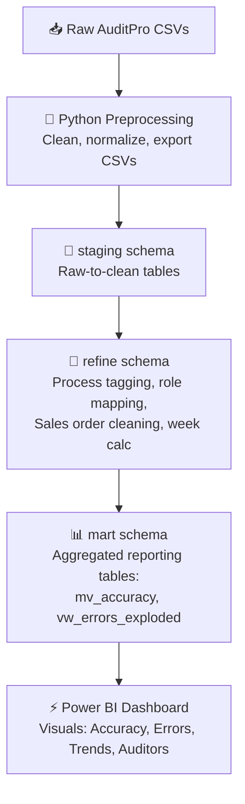

# 🔍 QA Performance Dashboard – Power BI  

  

---

## 🧭 Project Overview  

This Power BI dashboard visualizes the performance of the <b>Quality Assurance (QA) team</b> for a BPO account using data extracted from <b>AuditPro</b>.  
It tracks <b>QA Scores, Error Categories, Accuracy Rates,</b> and <b>Audit Type Distributions</b> — empowering QA Leads and Operations Managers to identify trends, detect recurring issues, and strengthen quality compliance.

---

## ⚙️ Workflow & Data Pipeline  

**📥 1. Data Extraction**  
- Exported QA audit snapshots (Error & Accuracy logs) from **AuditPro**.

**🐍 2. Data Preprocessing (Python)**  
- Cleaned and standardized CSVs using **Pandas**.  
- Normalized inconsistent formats and anonymized sensitive data.

**🗄️ 3. Data Transformation (PostgreSQL)**  
- Rebuilt transformation logic from Power Query into **SQL views** and **materialized views** for scalability and clarity.  
- Implemented a modular schema pipeline:
  - 🧱 **staging** – raw-to-clean data transformations  
  - 🔄 **refine** – process tagging, standardization, role mapping  
  - 📊 **mart** – reporting tables for Accuracy & Error sheets  
- Used **CTEs**, **UNNEST()**, and **string_to_array()** for splitting multi-error columns, trimming text, and aggregating counts.

**⚙️ 4. Light Shaping (Power Query)**  
- Final column ordering and binding before loading into Power BI.

**📊 5. Visualization (Power BI)**  
- Designed interactive dashboards for error trends, weekly accuracy, and auditor productivity using **DAX** and custom visuals.

> 🗓️ **Data Coverage:** July 16 – September 25, 2025  
> Extracted from AuditPro as a static, non-refreshing dataset.

---

## 🧠 SQL ETL Pipeline Diagram  

---

## 📌 Key Metrics & Insights  

---

## 🛠️ Tools & Technologies  
- **Python (Pandas)** – Data cleaning and date normalization  
- **PostgreSQL + Power Query** – ETL and structured data transformation  
- **Power BI** – Data modeling and visualization  

---

## 🚀 Impact  
- Provided QA and Operations with an automated view of audit results across teams and processes.  
- Helped identify recurring error types and training gaps for targeted improvement.  
- Reduced manual QA reporting time through a consistent, refreshable data model.  
- Supported data-driven decision-making through visual summaries of quality metrics.  

---

## 📁 Repository Contents  
- `README.md` – Project documentation  
- `data-prep/` – Python script and processed CSV
- `sql-pipeline/` – SQL Scripts used for data transformation
- `dashboard/` – Power BI file and dashboard screenshots  
- `assets/` – Visuals, banners, and logos  

---

---

## 🔗 Dashboard Access  
[**View Power BI Dashboard ↗**](https://app.powerbi.com/view?r=YOUR_DASHBOARD_LINK)

---

## 🖼️ Visual Preview  

  

---

## 📥 Resources  
- [PostgreSQL ETL Scripts](./sql-pipeline/)  
- [Processed CSV Data](./data-prep/Audit_Data_Processed.csv)  
- [Python Preprocessing Script](./data-prep/QA%20Report%20Data%20Processing.ipynb)

---

## 📎 Data Notes  
- **Source:** AuditPro QA Audit Logs (BPO Account)  
- **Period:** July 16 – September 25, 2025  
- **Type:** Static snapshot (non-refreshing)  
- **Sensitive data:** Fully anonymized before publication  

---

  ⚡ <b>Repository:</b> qa-performance-dashboard  
    
  

